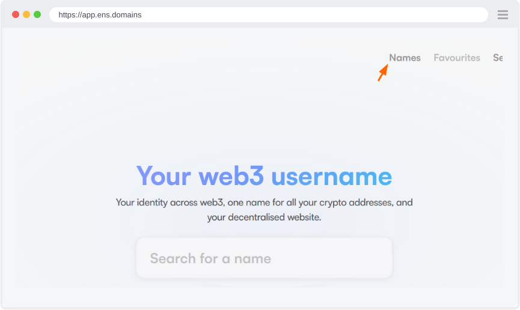
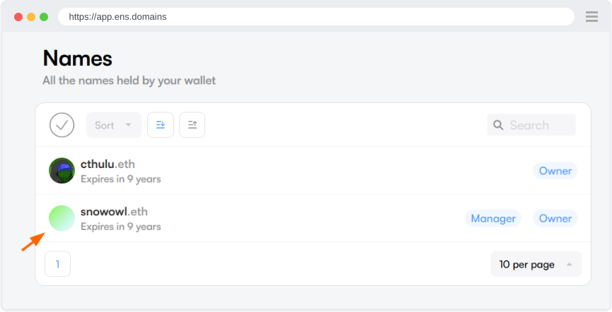
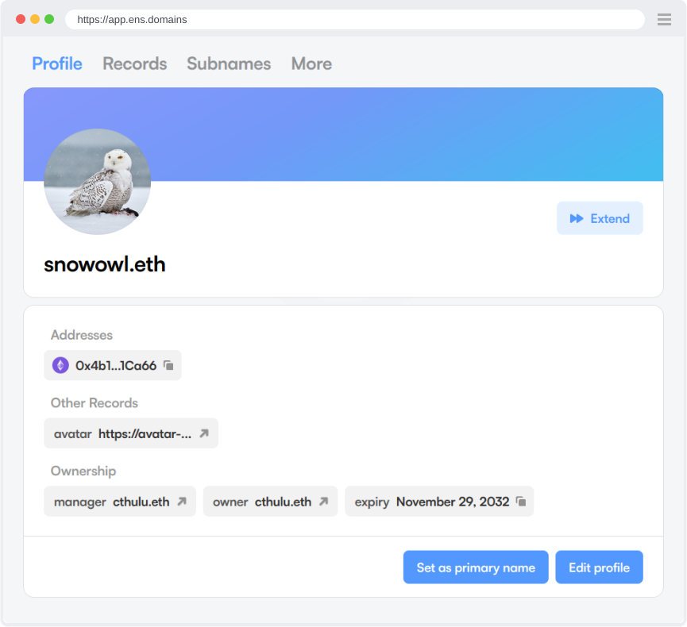
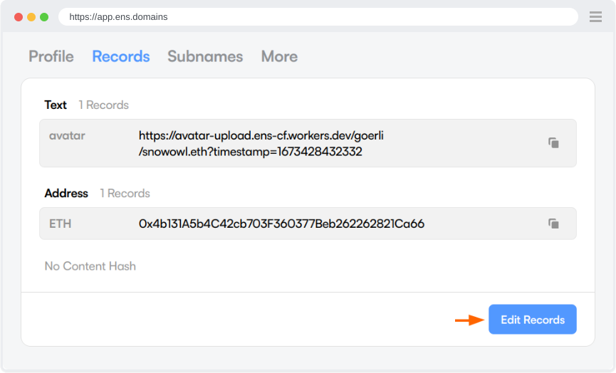
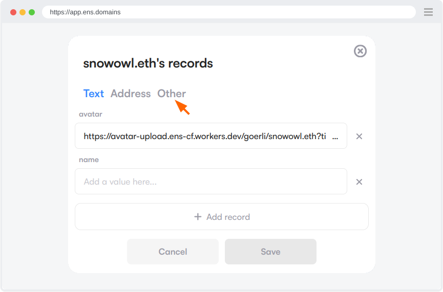
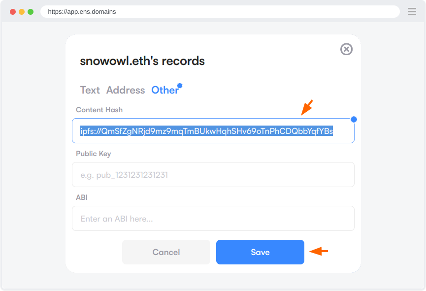
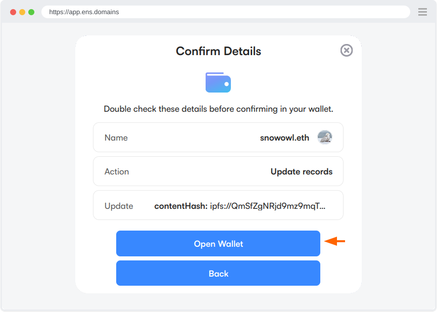
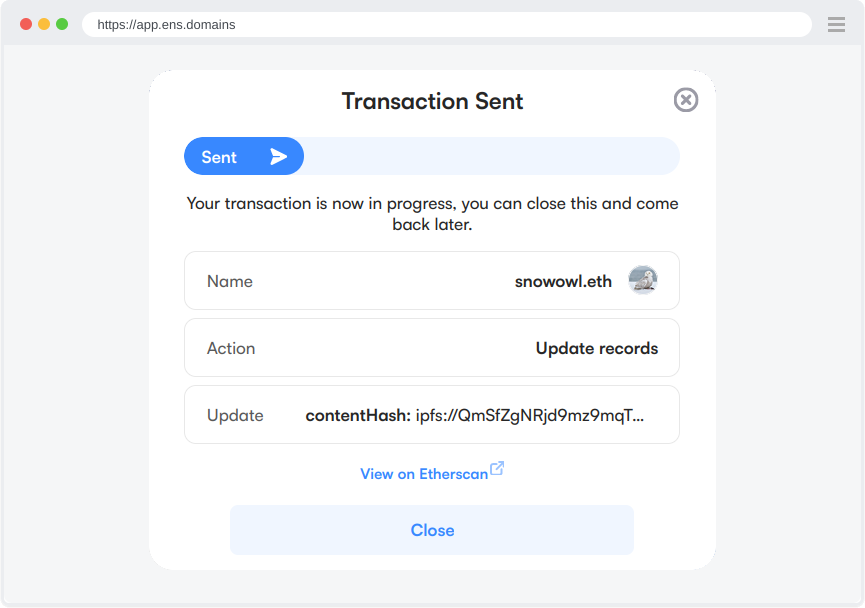
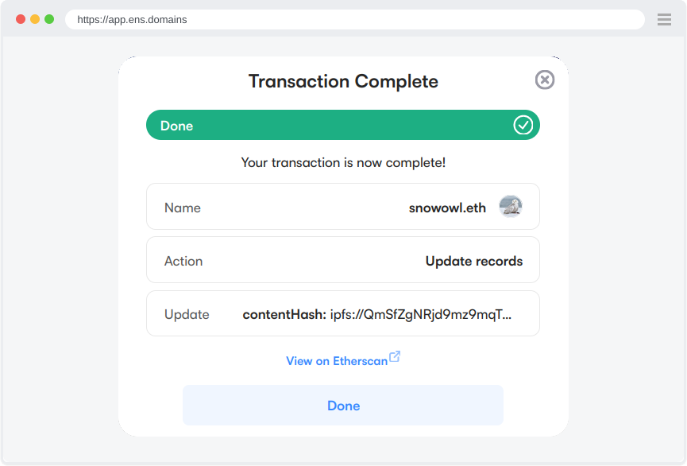
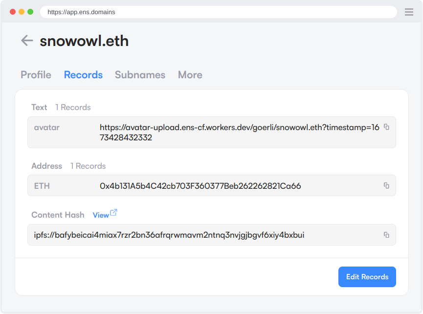

# Updating Your ENS Content Records

### Go to the ENS Manager App 

Go to the [ENS Manager App](https://app.ens.domains/) with the wallet set as Manager for the ENS name you want to manage and click Names to bring up a list of your ENS names _or_ search for an ENS name you own directly from the main page.

<figure><figcaption></figcaption></figure>

Click the ENS name you want to add the content record to.

<figure><figcaption></figcaption></figure>

Go to the Records tab

<figure><figcaption></figcaption></figure>

Click Edit Records

<figure><figcaption></figcaption></figure>

Then go to the Other tab

<figure><figcaption></figcaption></figure>

Type in the IPFS CID you saved earlier into the Content field and then click Save\
​

The content hash field accepts any supported storage protocol — enter your identifier with the matching prefix:

| Protocol | Format | Where it comes from |
| -------- | ------ | ------------------- |
| IPFS | `ipfs://bafy...` | [Uploading to IPFS](../../beginner/how-to-use-ipfs-ipns/uploading-to-ipfs/README.md) |
| IPNS | `ipns://k51...` | [How to Publish to IPNS](../../ipns-publishing/how-to-publish-to-ipns.md) |
| Arweave / ArNS | `ar://<transaction-id>` | [Arweave and ArNS](../../advanced/arweave-arns.md) |
| Swarm | `bzz://<64-hex-reference>` | [Hosting on Swarm](../../swarm/hosting-on-swarm.md) |
| TON Sites | `adnl://<adnl-address>` | [TON Sites](../../ton/ton-sites.md) |

<figure><figcaption></figcaption></figure>

Click Open Wallet and confirm the transaction in your wallet.

<figure><figcaption></figcaption></figure>

Wait for the transaction to complete.

<figure><figcaption></figcaption></figure>

Once the transaction has completed you should see a screen like this, it means that the changes to the content record is now stored on-chain. Click Done to go back to the Manager.

<figure><figcaption></figcaption></figure>

You should now see the Content Hash record populated with the IPFS CID you entered.

<figure><figcaption></figcaption></figure>

Congratulations! That's it! Now you can try visiting your website!

### ENS Compatible browsers[​](http://localhost:3000/howto/decentralized-website#ens-compatible-browsers) 

For ENS resolution in the browser address bar to work, the browser needs to be compatible with ENS or have the Metamask extension installed.

Some browsers which are more oriented towards Web3 support ENS right out of the box:

* [Brave Browser](https://brave.com/)
* [Opera Browser](https://www.opera.com/)

Other browsers will need to have an extension installed for it to work, such as the Metamask browser extension:

* [Google Chrome](https://www.google.com/chrome)
* [Mozilla Firefox](https://www.mozilla.org/)

### ETH.LIMO - Web3 Gateway 

You can also use the eth.limo web3 gateway by entering in your-ens-name.eth.limo into any browser address bar, regardless of if it supports ENS names natively or not.
