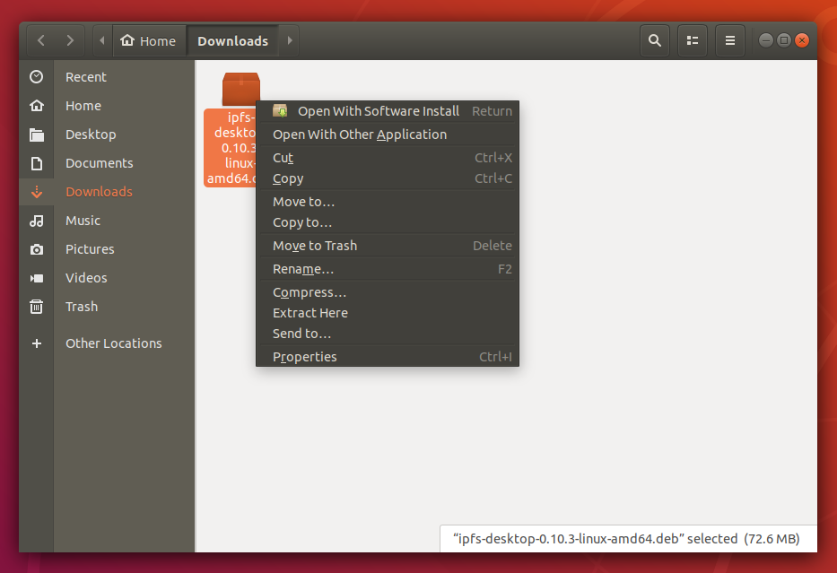
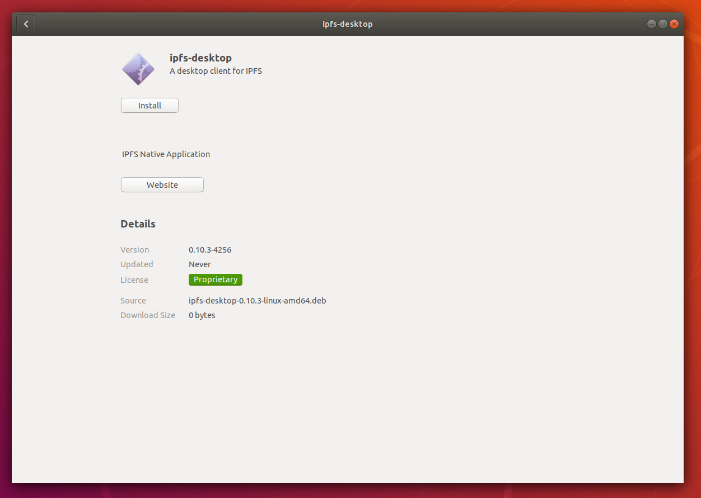
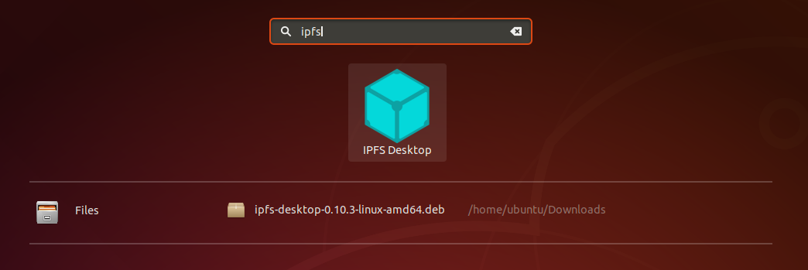
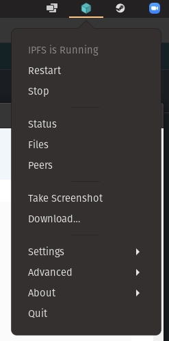

# IPFS Desktop (Linux)

#### Linux 

1. Download the latest available `.deb` file from the [IPFS desktop downloads page (opens new window)](https://github.com/ipfs/ipfs-desktop/releases):
2.  Open the `.deb` package in **Software Installer**:

    
3.  Click **Install** and wait for the installation to finish:

    
4. Click **Applications** or press the Windows key on your keyboard.
5.  Search for `IPFS` and select **IPFS Desktop**:

    
6.  You can now find an IPFS icon in the status bar:

    

The IPFS desktop application has finished installing. You can now start to [add your site](https://docs.ipfs.tech/how-to/websites-on-ipfs/single-page-website/#add-your-site).
