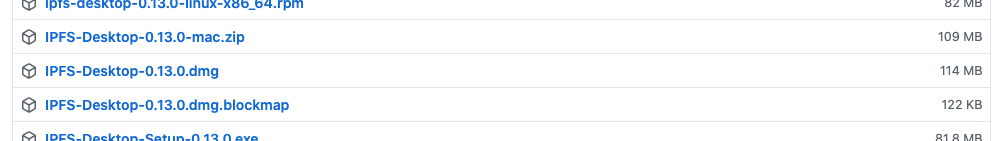
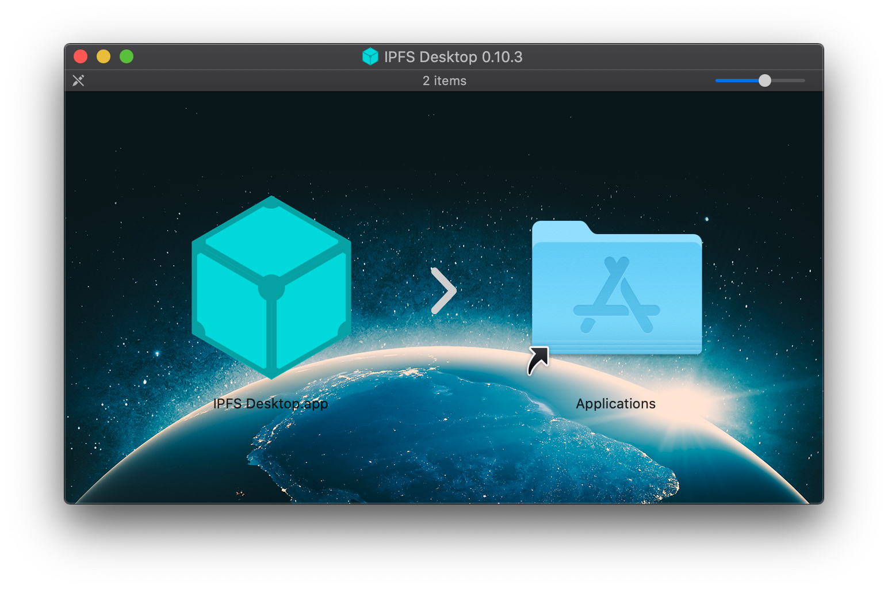
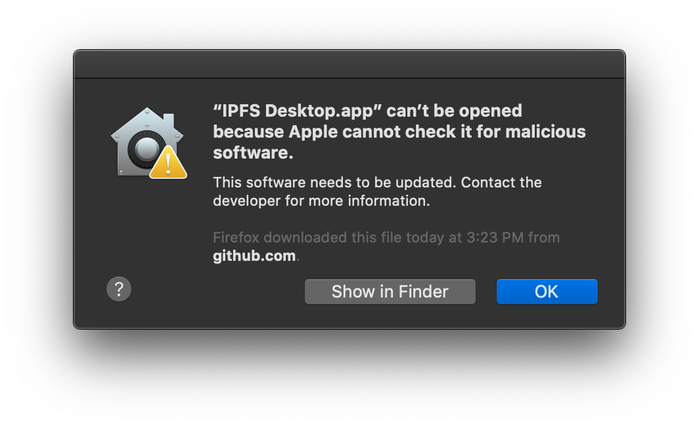
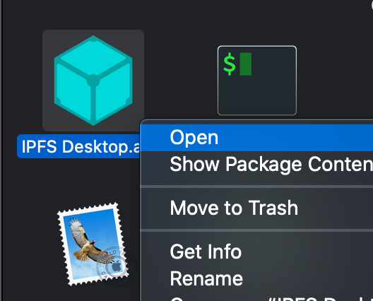
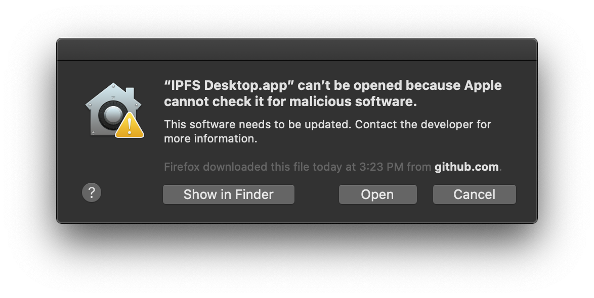
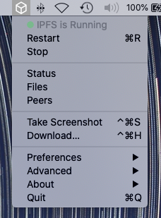

# IPFS Desktop (Mac)

#### [#](https://docs.ipfs.tech/how-to/websites-on-ipfs/single-page-website/#macos)MacOS 

1.  Download the latest available `.dmg` file from the [IPFS desktop downloads page (opens new window)](https://github.com/ipfs/ipfs-desktop/releases):

    
2. Open the `ipfs-desktop.dmg` file.
3.  Drag the IPFS icon into the **Applications** folder:

    
4. Open your **Applications** folder and open the IPFS desktop application.
5.  You may get a warning saying _IPFS Desktop.app can't be opened_. Click **Show in Finder**:

    
6. Find **IPFS Desktop.app** in your **Applications** folder.
7.  Hold down the `control` key, click **IPFS Desktop.app**, and click **Open**:

    
8.  Click **Open** in the new window:

    
9.  You can now find an IPFS icon in the status bar:

    

The IPFS desktop application has finished installing. You can now start to [add your site](https://docs.ipfs.tech/how-to/websites-on-ipfs/single-page-website/#add-your-site).
