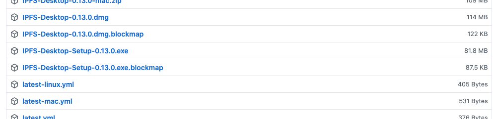
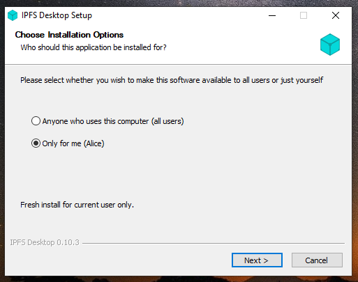
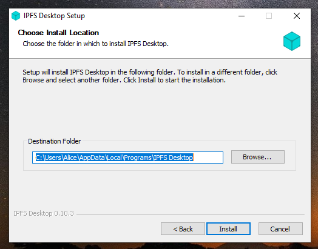
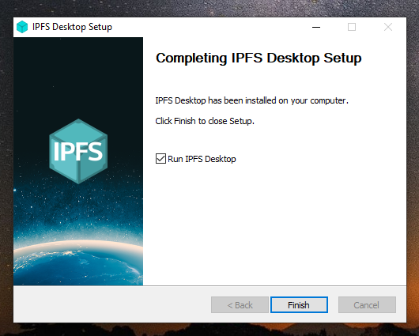
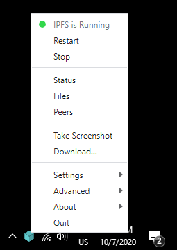

# IPFS Desktop (Windows)

#### Windows 

1.  Download the latest available `.exe` file from the [IPFS desktop downloads page (opens new window)](https://github.com/ipfs/ipfs-desktop/releases):

    
2. Run the `.exe` file to start the installation.
3.  Select whether you want to install the application for just yourself or all users on the computer. Click **Next**:

    
4.  Select the install location for the application. The default location is usually fine. Click **Next**:

    
5.  Wait for the installation to finish and click **Finish**:

    
6.  You can now find an IPFS icon in the status bar:

    

The IPFS desktop application has finished installing. You can now start to [add your site](https://docs.ipfs.tech/how-to/websites-on-ipfs/single-page-website/#add-your-site).
