# Filebase IPFS Pinning

New to pinning? See [What is IPFS Pinning?](../ipfs/what-is-ipfs-pinning.md) for the concepts — garbage collection, why pinning is required, and when to use a pinning service.

### How To Pin New Data on IPFS With Filebase 

Files uploaded to an IPFS bucket on Filebase are _automatically_ pinned to IPFS and stored with **3x** **replication** across the Filebase infrastructure by default, at no extra cost to you. This means your data is accessible and reliable in the event of a disaster or outage, and won't be affected by the IPFS garbage collection process.

#### Uploading a File to IPFS Through The Filebase Web Dashboard 

1\. Start by clicking on the ‘Buckets’ option from the menu to open the Buckets dashboard.

<figure>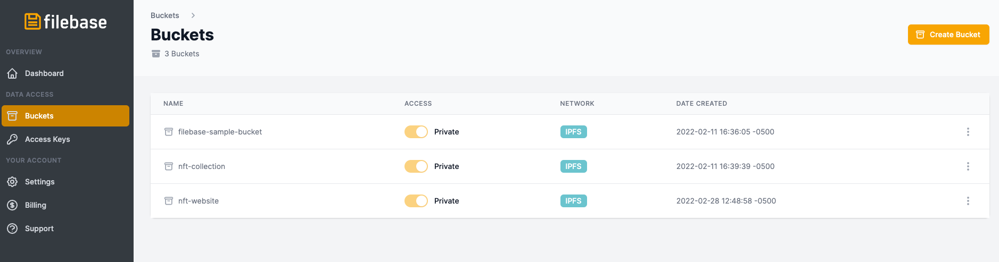<figcaption></figcaption></figure>

2\. Select your IPFS Bucket.

3\. After clicking on the bucket name, you will see any previously uploaded files. To upload another file, select 'Upload', then select 'File' from the options.

<figure>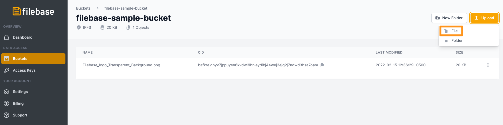<figcaption></figcaption></figure>

4\. Select the file you want to upload to the IPFS.

5\. Once uploaded, you will be able to view and copy the IPFS CID from the 'CID' category, as seen below.

<figure>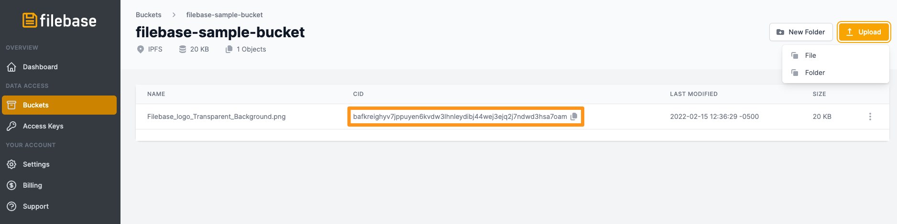<figcaption></figcaption></figure>

#### Uploading a Folder to IPFS Through The Filebase Web Console 

1\. Start by clicking on the ‘Buckets’ option from the menu to open the Buckets dashboard.

<figure><figcaption></figcaption></figure>

2\. Select your IPFS Bucket.

3\. After clicking on the bucket name, you will see any previously uploaded files. To upload another file, select 'Upload', then select 'Folder' from the options.

<figure>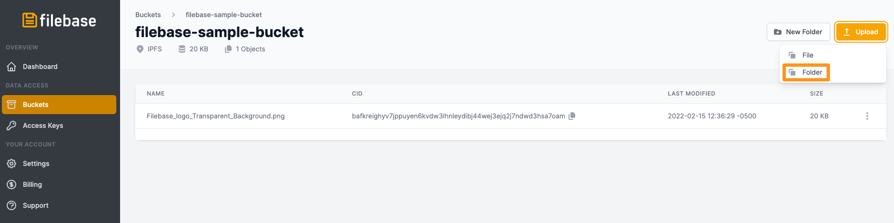<figcaption></figcaption></figure>

4\. Select the folder you'd like to upload to IPFS.

5\. Once uploaded, the folder will look similar to IPFS individual files.

<figure>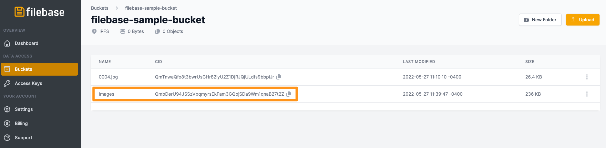<figcaption></figcaption></figure>

6\. Copy the IPFS CID for your folder, then navigate to `https://ipfs.filebase.io/ipfs/[CID]`. The contents of your folder will be listed.

<figure>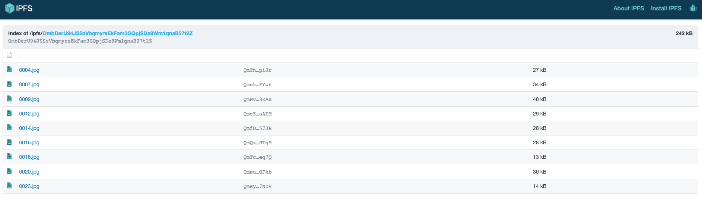<figcaption></figcaption></figure>

#### Uploading a File to IPFS Using the S3-Compatible API 

If you're using the S3 compatible API, the CID will be returned in the response of a PutObject call.

For example, if we run the following AWS CLI command:

`aws --endpoint https://s3.filebase.com s3 cp test-images/7FIMFhlMf6A.jpg s3://ipfs-test --debug`

For more information on AWS CLI, see [here.](https://docs.filebase.com/third-party-tools-and-clients/cli-tools/aws-cli)

The response is shown below. For convenience, we've highlighted the respective response header:

<figure>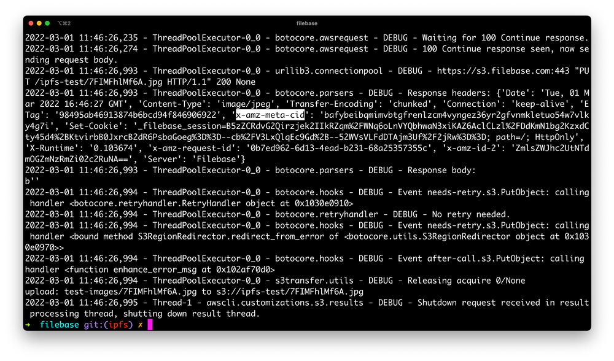<figcaption></figcaption></figure>

You can also call the HeadObject API to fetch the CID at any time as well:

`aws --endpoint https://s3.filebase.com s3api head-object --bucket ipfs-test --key 7FIMFhlMf6A.jpg`

<figure>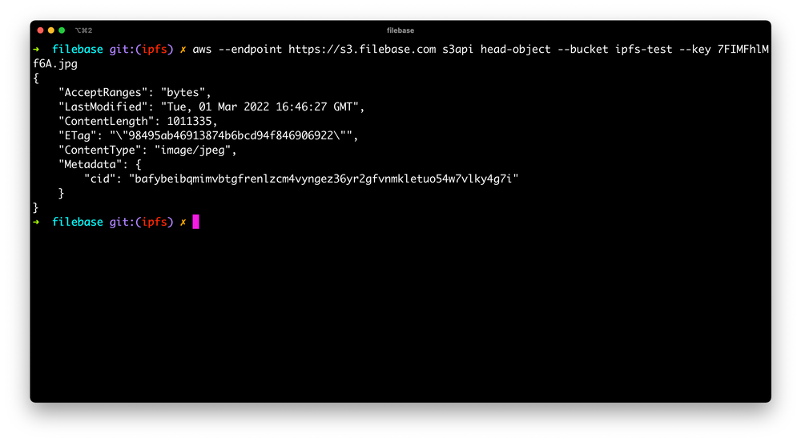<figcaption></figcaption></figure>

#### Uploading a Folder to IPFS Using IPFS Desktop then Pinning it Using Filebase 

1. Start by downloading the [IPFS Desktop GUI client](https://github.com/ipfs/ipfs-desktop/releases), or navigating to the [IPFS Web UI.](https://github.com/ipfs/ipfs-webui)
2. Select 'Files' from the left side bar menu.

<figure>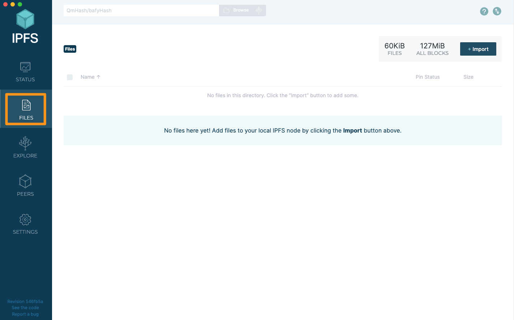<figcaption></figcaption></figure>

1. Select 'Import'

<figure>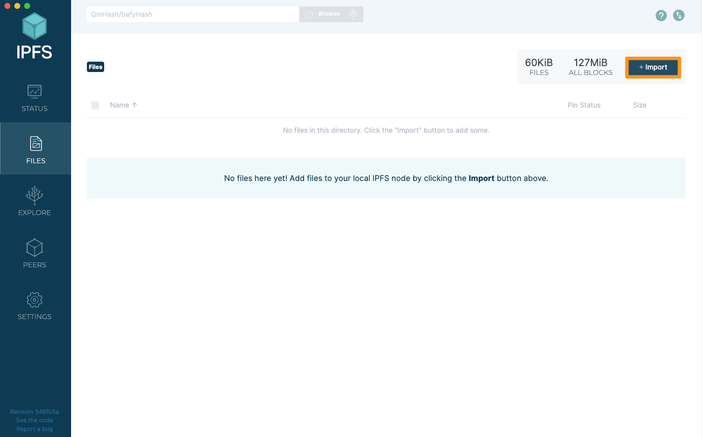<figcaption></figcaption></figure>

1. Select 'Folder' from the list of options.

<figure>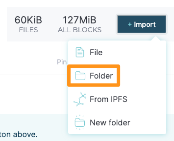<figcaption></figcaption></figure>

1. Select the folder you'd like to upload. Once it has been imported into IPFS Desktop, select the three dots to the right of the screen.

<figure>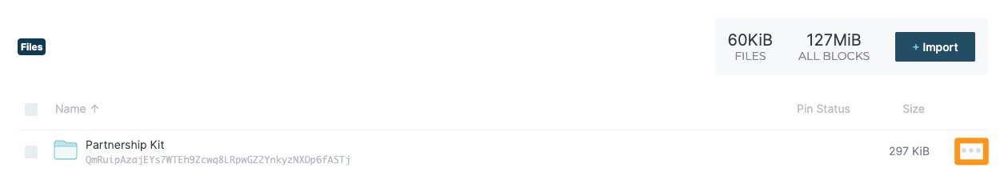<figcaption></figcaption></figure>

1. From the list of options, select 'Copy CID'.

<figure>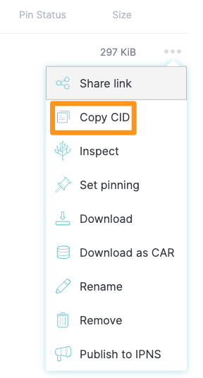<figcaption></figcaption></figure>

1. Next, navigate to the [Filebase Web Console dashboard](https://console.filebase.com/). Click on the ‘Buckets’ option from the menu to open the Buckets dashboard.

<figure>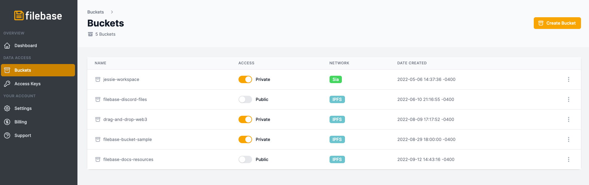<figcaption></figcaption></figure>

8\. Once at the Buckets dashboard, create a new IPFS bucket by clicking the ‘Create Bucket’ option in the top right corner.

<figure>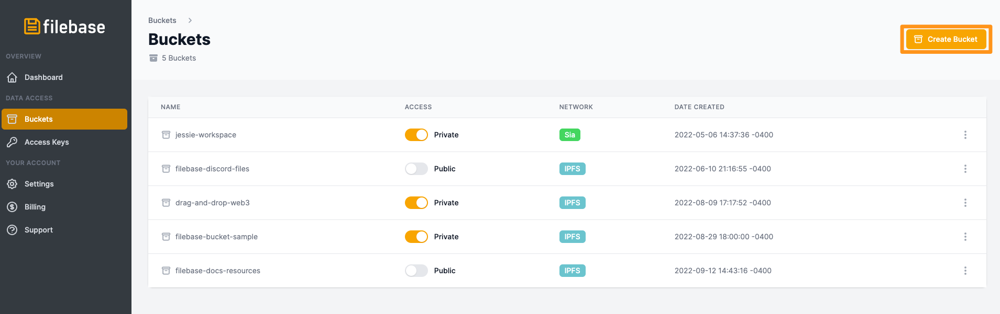<figcaption></figcaption></figure>

9\. Enter a bucket name and choose the IPFS network.

_Bucket names must be unique across all Filebase users, be between 3 and 63 characters long, and can contain only lowercase characters, numbers, and dashes._

<figure>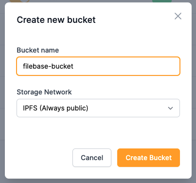<figcaption></figcaption></figure>

10\. Then select your new IPFS Bucket.

11\. After clicking on the bucket name, select 'Upload' from the top right corner, then select 'CID'.

Pin by CID is a paid feature that requires a paid Filebase IPFS subscription plan.

<figure>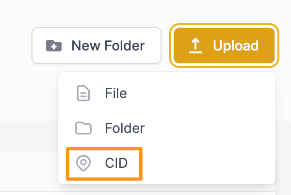<figcaption></figcaption></figure>

12\. Then enter your IPFS CID that you copied from IPFS Desktop and a custom human-readable name to associate with your CID.

<figure>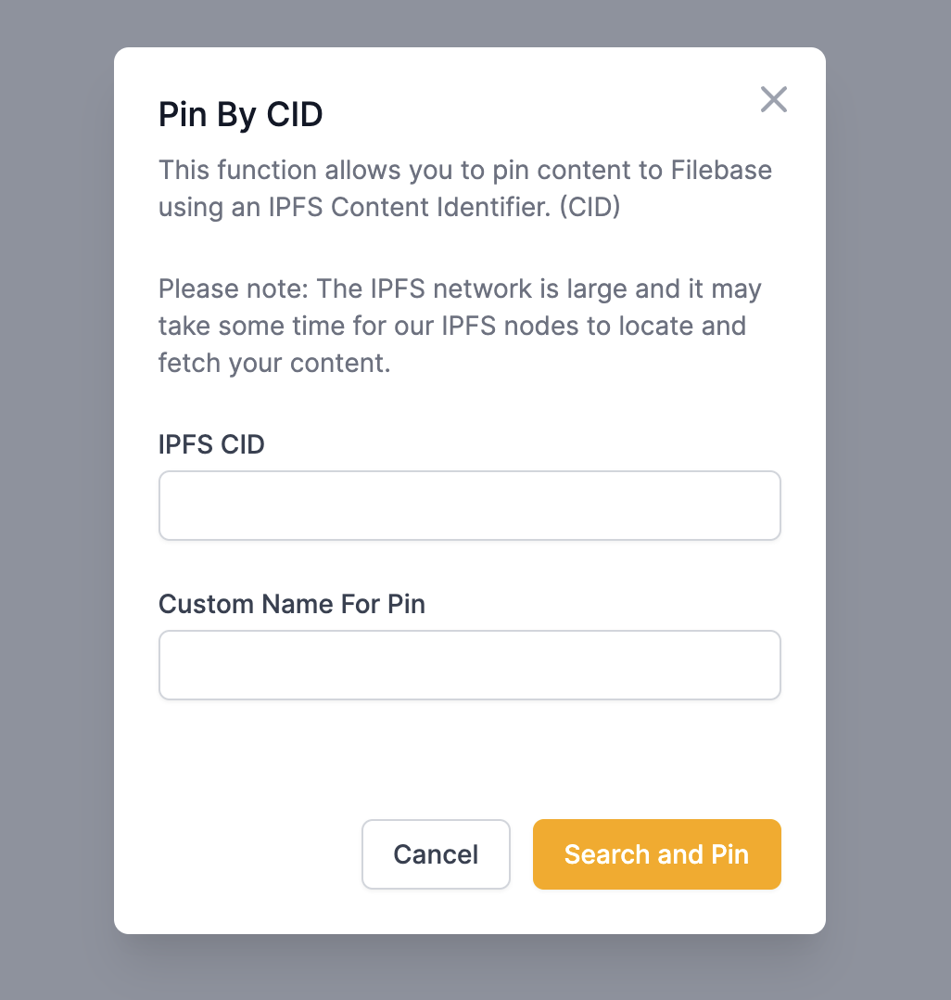<figcaption></figcaption></figure>

13\. Select 'Search and Pin' to pin your CID to IPFS through Filebase.

**Note:** The IPFS network is large and it may take some time for Filebase's IPFS nodes to locate and fetch the CID.
