# Using the Filebase Public IPFS Gateway

#### The Filebase public IPFS gateway is: <a href="#the-filebase-public-ipfs-gateway-is" id="the-filebase-public-ipfs-gateway-is"></a>

`https://ipfs.filebase.io/ipfs/<CID>`

The Filebase Public IPFS Gateway has an effective rate limit of 200 RPM (requests per minute).

The Filebase Public IPFS Gateway only serves content stored on Filebase.

Gateways can serve the CID of a folder instead of just a single file. In this scenario, it will return a file directory tree that contains the files located in the folder.

For example, the following IPFS gateway URL leads to a folder directory of files:

`https://ipfs.filebase.io/ipfs/QmWTqpfKyPJcGuWWg73beJJiL6FrCB5yX8qfcCF4bHvane`

Gateways can also be used to serve static websites. The following URL leads to a static webpage, hosted on IPFS using a folder containing a static HTML file and image files:

`https://ipfs.filebase.io/ipfs/QmYRpH3myNKG2XeaBmdidec3R5HcF9PYBHUVHfks5ysTpq/`

For background on how gateways retrieve content and the difference between public, dedicated, and self-hosted gateways, see [IPFS Gateways](../ipfs/ipfs-gateways.md).

## Creating a Dedicated Gateway <a href="#creating-a-dedicated-gateway" id="creating-a-dedicated-gateway"></a>

Navigate to the [Gateways page](https://console.filebase.com/gateways) on the Filebase web console.

Select the ‘Create Gateway’ button in the upper right corner.

<figure>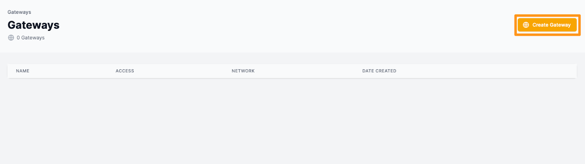<figcaption></figcaption></figure>

A new window will open prompting you to provide a gateway name and select the gateway’s access level.

Gateway names are subject to the same naming restrictions as bucket names. All gateway names must be lowercase, between 3-63 characters, and must be unique.

<figure>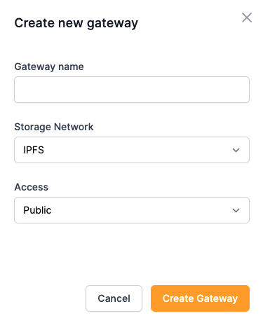<figcaption></figcaption></figure>

Gateways can be public, private, or scoped.

#### Public Gateways <a href="#public-gateways" id="public-gateways"></a>

To create a public gateway, select ‘Public’. This can be changed after the gateway has been created.

<figure>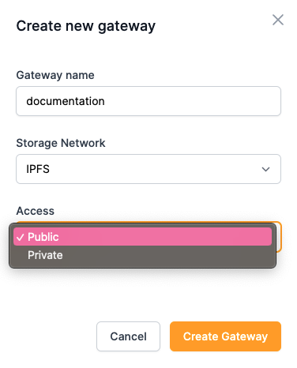<figcaption></figcaption></figure>

#### Private Gateways <a href="#private-gateways" id="private-gateways"></a>

To create a private gateway, select ‘Private’. This can be changed after the gateway has been created.

<figure>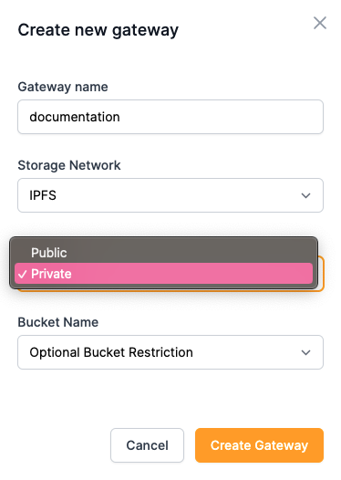<figcaption></figcaption></figure>

#### Scoped Gateways <a href="#scoped-gateways" id="scoped-gateways"></a>

To create a scoped gateway, select ‘Private’, then select a bucket name from the drop-down menu for the scoped gateway to serve. Scoped gateways only serve content located in the bucket that they are restricted to.

Note: If a gateway is configured to serve a root CID, it cannot also be configured to be restricted to a bucket. The root CID configuration must be cleared to configure a bucket restriction.

<figure>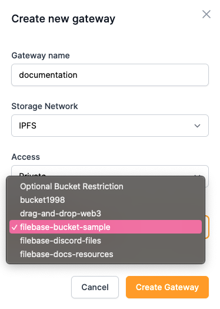<figcaption></figcaption></figure>

Alternatively, if you want to set a bucket restriction for a gateway that was previously created, you can set the restriction by navigating to the [Buckets](https://console.filebase.com/buckets) menu and selecting the three menu dots for the bucket you’d like to restrict your gateway to. Then select ‘Set Restriction’.

<figure>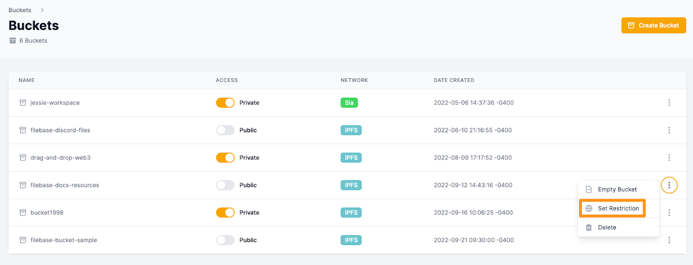<figcaption></figcaption></figure>

When prompted, select the gateway you want configured to use the selected bucket.

<figure>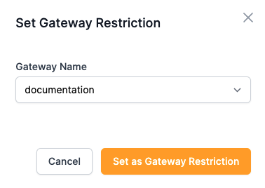<figcaption></figcaption></figure>

#### Removing a Bucket Restriction <a href="#removing-a-bucket-restriction" id="removing-a-bucket-restriction"></a>

To remove the bucket restriction on a gateway, navigate to the [Gateways](https://console.filebase.com/gateways) page, select the three menu dots on the right-hand side, then select ‘Clear Bucket Restrictions'

<figure>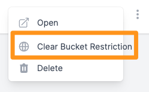<figcaption></figcaption></figure>

You will be prompted to confirm the removal.

<figure>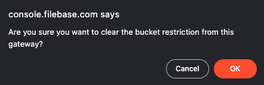<figcaption></figcaption></figure>

#### Interacting With Gateways <a href="#interacting-with-gateways" id="interacting-with-gateways"></a>

Once a gateway has been created, a subdomain record is created that points to your dedicated gateway. For example, the dedicated gateway called 'documentation' will use the gateway URL:

[https://documentation.myfilebase.com/](https://documentation.myfilebase.com/)

**Toggling Private/Public Access**

To toggle between public and private access for a dedicated gateway, use the toggle switch that functions identically to the public and private access toggle switch for buckets.

<figure>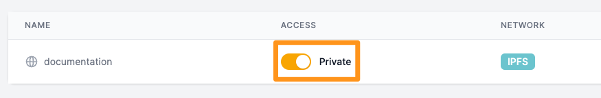<figcaption></figcaption></figure>

To interact with the gateway, you can select the three menu dots to open a list of options.

<figure>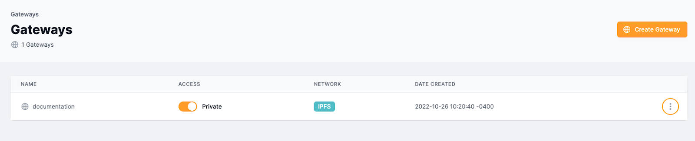<figcaption></figcaption></figure>

To open the gateway URL, select ‘Open’.

<figure>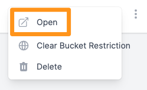<figcaption></figcaption></figure>

By default, the URL will return the following webpage:

<figure>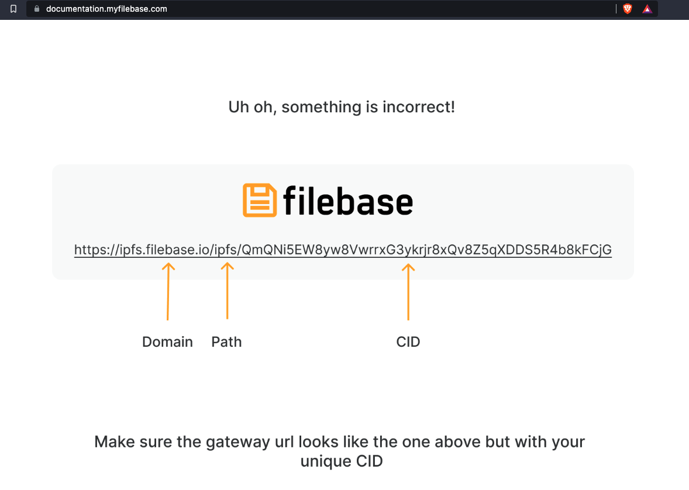<figcaption></figcaption></figure>

This webpage is returned since there is no CID included in the URL. However, gateways can be configured to serve a CID or file as its root. This means instead of this default webpage, you can configure a different default static webpage or another file to be viewed by default rather than this error message.

This is most commonly used to serve static websites from a domain. Using this feature, [http://documentation.myfilebase.com/](http://documentation.myfilebase.com/) would return the file you selected, without having to enter a CID or path in the URL.

## Setting a CID as the Root of the Dedicated Gateway <a href="#setting-a-cid-as-the-root-of-the-dedicated-gateway" id="setting-a-cid-as-the-root-of-the-dedicated-gateway"></a>

Note: If a gateway is configured to be restricted to a bucket, it cannot be configured to have a root CID. The bucket restriction configuration will need to be cleared before a root CID can be configured for the gateway.

To configure this, navigate to the [Buckets](https://console.filebase.com/buckets) menu, and select an IPFS bucket.

<figure>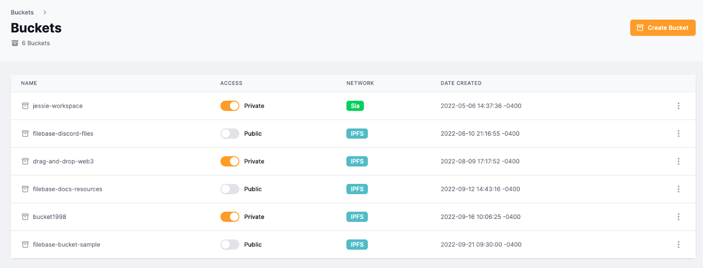<figcaption></figcaption></figure>

Once inside the bucket, select the file you’d like to set as the root file by selecting the three menu dots on the right-hand side.

<figure>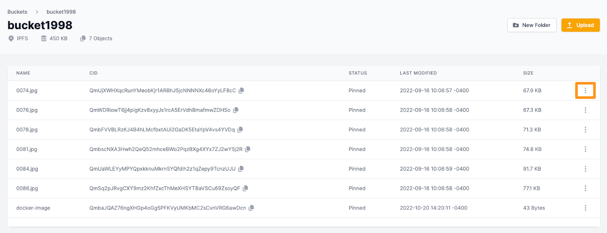<figcaption></figcaption></figure>

Select ‘Set as Root’.

<figure>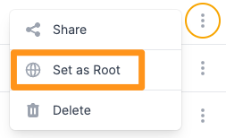<figcaption></figcaption></figure>

Then choose the dedicated gateway you’d like to use.

<figure>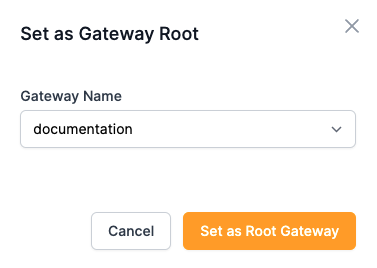<figcaption></figcaption></figure>

Now, when you open the gateway, you’ll see the file you set as the root file displayed rather than the default error message.

<figure>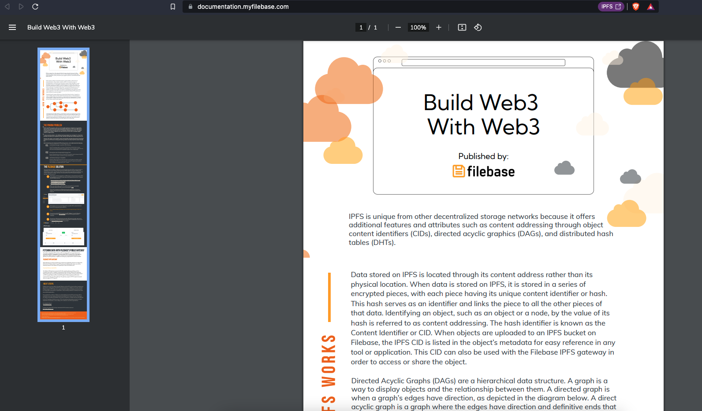<figcaption></figcaption></figure>

#### Removing a Root CID From a Gateway <a href="#removing-a-root-cid-from-a-gateway" id="removing-a-root-cid-from-a-gateway"></a>

To remove a CID set as the root CID for a dedicated gateway, navigate to the [Gateways](https://console.filebase.com/gateways) page, then select the three menu dots and select ‘Clear Root CID’.

<figure>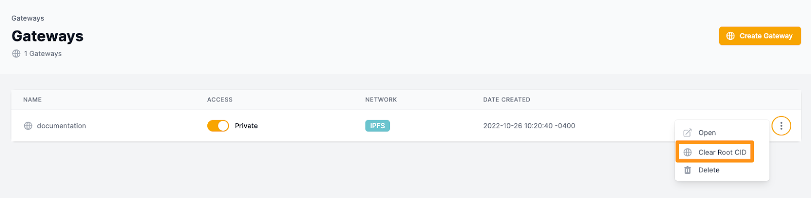<figcaption></figcaption></figure>

You will be prompted to confirm the removal.

<figure>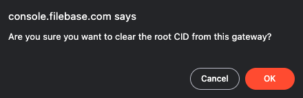<figcaption></figcaption></figure>

#### Deleting a Gateway <a href="#deleting-a-gateway" id="deleting-a-gateway"></a>

To delete a dedicated gateway, navigate to the [Gateways](https://console.filebase.com/gateways) page in the Filebase web console dashboard.

<figure>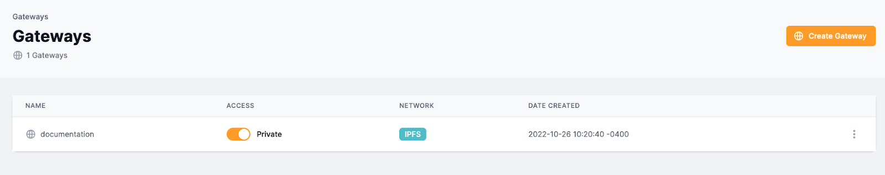<figcaption></figcaption></figure>

Select the options menu by clicking the three dots on the right-hand side corresponding with the gateway you want to remove. Then select ‘Delete’.

<figure>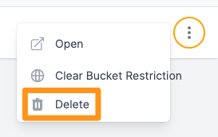<figcaption></figcaption></figure>

You will be prompted to confirm the removal.

### **Filebase IPFS Image Optimization** <a href="#filebase-ipfs-image-optimization" id="filebase-ipfs-image-optimization"></a>

Filebase provides an image optimization functionality directly through the Filebase IPFS dedicated gateway feature.

Through this feature, image load time and the overall image experience can be improved.

Any image file that is uploaded to Filebase can be manipulated through query string parameters. To utilize image optimization, at least one option must be specified:

*   **Resize**:

    ```
    ?img-width=300
    ```
*   **Quality**:

    ```
    ?img-quality=75
    ```
*   **Format**:

    ```
    ?img-format=auto
    ```

For example, if the default image URL is:

`https://documentation.myfilebase.com/ipfs/QmVnf5PnSUvjrPkc9tDgpwqcreKWh7xVyXDwDmS6xwchWp`

the resized variant is:

```
https://documentation.myfilebase.com/ipfs/QmVnf5PnSUvjrPkc9tDgpwqcreKWh7xVyXDwDmS6xwchWp?img-width=300
```

You can [sign up](https://filebase.com/signup) for a free Filebase account to get started with IPFS today.
